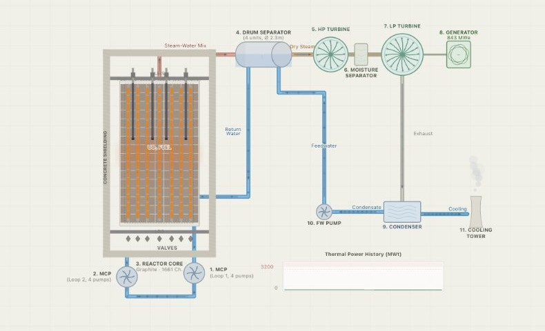

# RBMK-1000 Reactor Simulation

An interactive, browser-based model of an RBMK-1000 nuclear reactor, the Soviet
design behind the 1986 Chernobyl accident. It is detailed enough to show *why*
that accident happened: the positive void coefficient, xenon-135 poisoning, the
graphite-tipped control rods, and the AZ-5 emergency shutdown that briefly
*raised* power before it dropped.

**Live:** https://natozenbilek.github.io/rbmk/



> Educational model. The physics is simplified for teaching and intuition, not
> for engineering analysis, and is not validated against real plant data.

## What you can do

- **Run the reactor** by hand or in **auto mode**: move the control rods (with a
  realistic belly-shaped differential-worth curve) and watch power, temperature,
  pressure, void fraction, reactivity (pcm), and turbine output respond live.
- **See the physics that mattered at Chernobyl**: the full iodine → xenon-135
  chain and the "xenon pit", a positive void coefficient, Doppler feedback,
  decay heat after shutdown, and the graphite-tip reactivity spike during a SCRAM.
- **Explore the plant**: an annotated, zoomable diagram of the primary heat
  circuit (core, drum separators, main circulation pumps, HP/LP turbines,
  generator, condenser, cooling tower), each with real engineering data.
- **Run scenarios and faults**: a guided **Chernobyl** reconstruction, an **MCP**
  (pump) trip, and a **pipe rupture**, across four modes (Free Play, Normal Ops
  with safety limits, Safety Training drills, Accident Analysis).
- **Review the run**: a **debrief** with peak values, an event timeline, and an
  operator rating. Share a run as a URL, trip **AZ-5 (SCRAM)**, toggle sound, or
  read the built-in physics notes and references.

## Built with

Plain HTML, CSS, and JavaScript in a single, self-contained `index.html` — no
framework, no build step. The plant diagram and its animation are drawn on a
`<canvas>`; the live readouts are plain HTML, and sound is synthesized with the
Web Audio API. Installable and offline-capable as a PWA.

```
index.html      the whole simulation (UI, physics, scenarios, help)
manifest.json   PWA manifest
sw.js           service worker (offline cache)
```

## Acknowledgments

The software is mine, but the nuclear engineering is theirs. I'm grateful to
[H. Nur Atmaca](https://www.linkedin.com/in/nuratmaca/) and
[Zehra Nur Şirin](https://www.linkedin.com/in/zehranursirin/), nuclear
engineering students at Hacettepe University, who taught me the reactor physics
behind this simulation, guided the model from the start, and patiently walked me
through the fundamentals.

## License

Released under the [MIT License](LICENSE).

Made by Nezih Arhan Tözenbilek, for learning.
